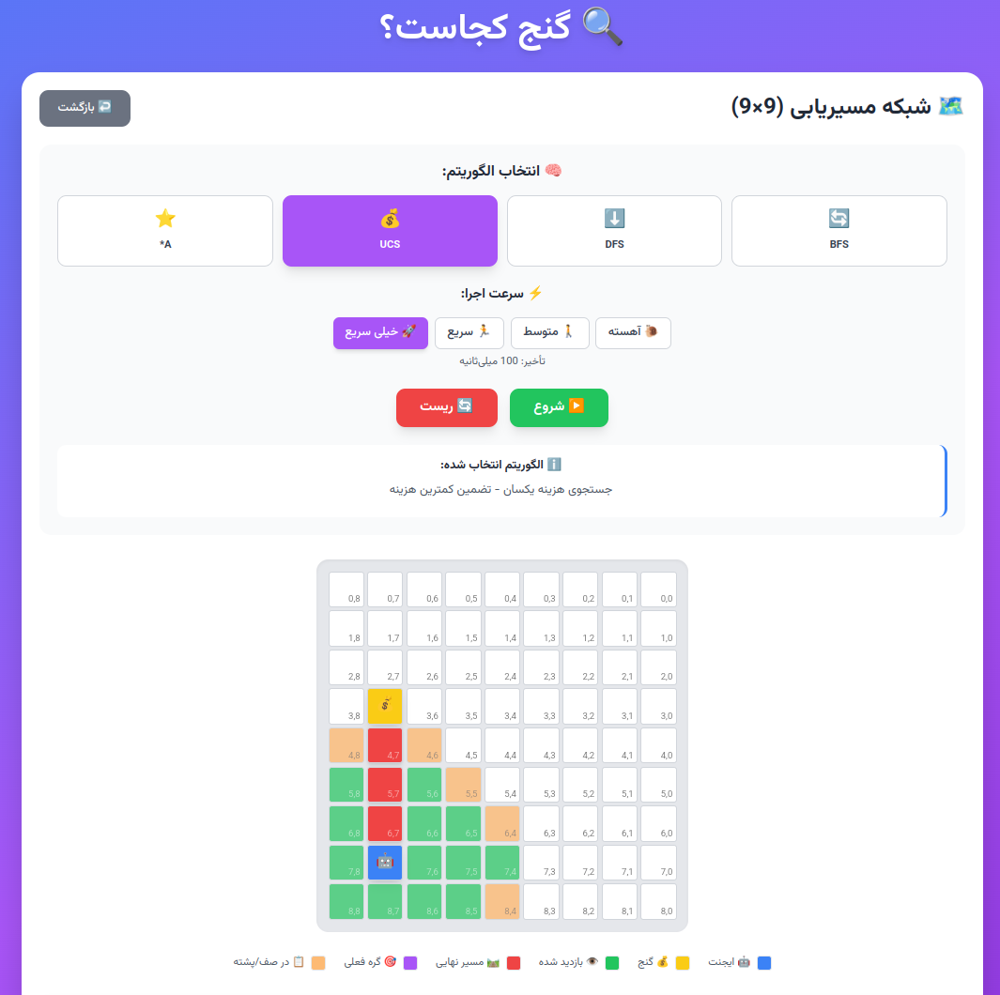

# Pathfinding Algorithms Visualization Project



## Table of Contents

- [Project Overview](#project-overview)
- [Features](#features)
- [Technical Architecture](#technical-architecture)
- [Components Breakdown](#components-breakdown)
- [Algorithms Implementation](#algorithms-implementation)
- [User Interface](#user-interface)
- [Performance Analysis](#performance-analysis)
- [Challenges and Solutions](#challenges-and-solutions)
- [Future Enhancements](#future-enhancements)
- [Conclusion](#conclusion)

## Project Overview

This React-based application provides an interactive visualization of various pathfinding algorithms. The project enables users to understand how different search algorithms work by visualizing their execution on a customizable grid. The application supports multiple algorithms including Breadth-First Search (BFS), Depth-First Search (DFS), Uniform Cost Search (UCS), and A* with different heuristics.

The project is designed with an educational focus, allowing users to:
- Visualize algorithm execution step by step
- Compare different algorithms' performance
- Understand the concepts of optimal paths and heuristics
- Adjust execution speed for better comprehension


## Features

### Core Features

1. **Interactive Grid Visualization**
   - Customizable grid size (2x2 up to 15x15)
   - Visual representation of start point, target point, and algorithm execution
   - Cell highlighting for visited nodes, queued nodes, and final path

2. **Multiple Algorithm Support**
   - Breadth-First Search (BFS)
   - Depth-First Search (DFS)
   - Uniform Cost Search (UCS)
   - A* with Manhattan and Euclidean distance heuristics

3. **Execution Control**
   - Start/Reset functionality
   - Adjustable execution speed (Slow, Medium, Fast, Very Fast)
   - Visual feedback during algorithm execution

4. **Performance Statistics**
   - Nodes explored count
   - Path length
   - Execution time
   - Path cost
   - Optimality indicator

## Technical Architecture

The project follows a component-based architecture typical of React applications, with a clear separation of concerns:

```
├── Components
│   ├── Cell.jsx            # Individual grid cell rendering
│   ├── ControlPanel.jsx    # Algorithm selection and execution controls
│   ├── GridSetup.jsx       # Initial grid size configuration
│   └── StatsPanel.jsx      # Performance statistics display
├── Algorithms
│   └── pathfindingAlgorithms.js  # Algorithm implementations
└── App.jsx                 # Main application component
```

The application uses a unidirectional data flow pattern, with state management handled at the top level and passed down to child components through props.

## Components Breakdown

### Cell Component

The Cell component is responsible for rendering individual grid cells with appropriate styling based on their current state:

- Regular cells with coordinates
- Agent cell (start point)
- Treasure cell (target point)
- Current cell being processed
- Path cells (final solution)
- Visited cells
- Queued cells

The component adapts its size and appearance based on the grid dimensions, ensuring good visibility on different grid sizes.

```jsx
// Cell sizing based on grid dimensions
if (size <= 5) {
    classes.push('w-16', 'h-16', 'text-2xl');
} else if (size <= 10) {
    classes.push('w-12', 'h-12', 'text-xl');
} else {
    classes.push('w-8', 'h-8', 'text-sm');
}
```

### ControlPanel Component

The ControlPanel provides the user interface for:

1. **Algorithm Selection**
   - Visual buttons for each algorithm with descriptions
   - Heuristic selection for A* algorithm

2. **Execution Speed Control**
   - Multiple speed options with intuitive icons
   - Visual feedback on current selection

3. **Execution Controls**
   - Start and Reset buttons
   - Disabled states during algorithm execution

4. **Algorithm Information**
   - Description of the selected algorithm
   - Heuristic information when applicable


### GridSetup Component

The GridSetup component handles the initial configuration of the grid:

- Input validation for grid size (2-15)
- Error handling and user feedback
- Responsive design for different screen sizes

### StatsPanel Component

The StatsPanel displays performance metrics after algorithm execution:

- Algorithm information and features
- Execution statistics (nodes explored, path length, execution time)
- Path optimality status
- Performance score calculation
- Visual indicators for success/failure


## Algorithms Implementation

The project implements four classic pathfinding algorithms with clean, modular code:

### Breadth-First Search (BFS)

BFS explores all nodes at the present depth before moving to nodes at the next depth level. This guarantees the shortest path in unweighted graphs.

```javascript
// BFS implementation core
const queue = [new Node(start.row, start.col)];
const visited = new Set();

while (queue.length > 0) {
    const current = queue.shift();
    // Process current node
    // Add unvisited neighbors to queue
}
```

### Depth-First Search (DFS)

DFS explores as far as possible along each branch before backtracking, using a stack data structure.

```javascript
// DFS implementation core
const stack = [new Node(start.row, start.col)];
const visited = new Set();

while (stack.length > 0) {
    const current = stack.pop();
    // Process current node
    // Add unvisited neighbors to stack
}
```

### Uniform Cost Search (UCS)

UCS expands the node with the lowest path cost, ensuring optimal paths when all step costs are equal or greater than zero.

```javascript
// UCS implementation core
const priorityQueue = new PriorityQueue();
priorityQueue.enqueue(startNode, 0);

while (!priorityQueue.isEmpty()) {
    const current = priorityQueue.dequeue();
    // Process current node
    // Add neighbors with updated costs to priority queue
}
```

### A* Algorithm

A* combines the advantages of Dijkstra's algorithm and greedy best-first search using a heuristic function to guide its search.

```javascript
// A* implementation core
const priorityQueue = new PriorityQueue();
const initialH = calculateHeuristic(start, target, heuristic);
priorityQueue.enqueue(new Node(start.row, start.col, null, 0, initialH), initialH);

while (!priorityQueue.isEmpty()) {
    const current = priorityQueue.dequeue();
    // Process current node
    // Add neighbors with updated f-scores to priority queue
}
```


## User Interface

The application features a modern, responsive UI built with Tailwind CSS, focusing on:

### Design Principles

1. **Clarity and Readability**
   - Clear visual hierarchy
   - Consistent color coding for different states
   - Informative tooltips and descriptions

2. **Responsive Design**
   - Adapts to different screen sizes
   - Grid cell sizing based on grid dimensions
   - Mobile-friendly controls

3. **Visual Feedback**
   - Animations for current processing and final path
   - Color coding for different cell states
   - Disabled controls during execution

4. **Accessibility**
   - High contrast colors
   - Clear labels and instructions
   - Keyboard-friendly interactions

### Color Scheme

- **Blue**: Agent position and BFS algorithm
- **Yellow**: Target position
- **Purple**: Current cell being processed
- **Red**: Final path
- **Green**: Visited cells
- **Orange**: Cells in queue/frontier


## Performance Analysis

### Algorithm Comparison

| Algorithm | Optimality | Space Complexity | Time Complexity | Best Use Case |
|-----------|------------|------------------|-----------------|---------------|
| BFS       | ✅ Optimal | O(b^d)           | O(b^d)          | Shortest path in unweighted graphs |
| DFS       | ❌ Not optimal | O(b*d)       | O(b^d)          | Memory-constrained environments |
| UCS       | ✅ Optimal | O(b^d)           | O(b^d)          | Weighted graphs with positive costs |
| A*        | ✅ Optimal | O(b^d)           | O(b^d)          | When good heuristics are available |

*where b is the branching factor and d is the depth of the solution*

### Performance Considerations

1. **Grid Size Impact**
   - Larger grids significantly increase the search space
   - UI adapts cell size for better visualization
   - Performance remains interactive up to 15x15 grids

2. **Algorithm Efficiency**
   - BFS and DFS: O(V+E) where V is vertices and E is edges
   - UCS and A*: O(E + V log V) with priority queue operations

3. **Visualization Overhead**
   - Step-by-step visualization adds delay
   - Adjustable speed controls help balance understanding vs. performance

## Challenges and Solutions

### Challenge 1: Balancing Visualization and Performance

**Problem**: Showing each step of the algorithm execution can be slow for large grids.

**Solution**: 
- Implemented adjustable speed controls
- Optimized rendering by using React's efficient update mechanisms
- Adapted cell size based on grid dimensions

### Challenge 2: Priority Queue Implementation

**Problem**: JavaScript doesn't have a built-in priority queue for algorithms like UCS and A*.

**Solution**:
- Custom PriorityQueue class implementation
- Efficient enqueue and dequeue operations
- Support for retrieving queue items for visualization

### Challenge 3: Path Reconstruction

**Problem**: Efficiently tracking and reconstructing the final path after finding the target.

**Solution**:
- Parent reference in each node
- Efficient path reconstruction by backtracking from target to start
- Clear visual distinction between visited nodes and final path

## Future Enhancements

1. **Additional Algorithms**
   - Bidirectional search
   - Greedy Best-First Search
   - Jump Point Search for grid-based pathfinding

2. **Enhanced Grid Features**
   - Obstacles and walls
   - Weighted edges (different terrain costs)
   - Diagonal movements
   - Custom start/end point selection

3. **Advanced Visualization**
   - Algorithm comparison mode
   - Step-by-step execution with forward/backward controls
   - Heat maps for node exploration
   - 3D visualization option

4. **Educational Features**
   - Algorithm explanation cards
   - Interactive tutorials
   - Code view alongside visualization
   - Downloadable execution reports

## Conclusion

This pathfinding visualization project successfully demonstrates the behavior and performance characteristics of four fundamental search algorithms. By providing an interactive, visual representation of these algorithms, the application serves as both an educational tool and a practical demonstration of React component architecture and algorithm implementation.

The project showcases:

1. **Effective React Component Design**
   - Clear separation of concerns
   - Reusable components
   - Efficient state management

2. **Algorithm Implementation**
   - Clean, modular code structure
   - Step-by-step visualization
   - Performance statistics

3. **Modern UI/UX Principles**
   - Responsive design with Tailwind CSS
   - Intuitive controls
   - Informative feedback

The combination of educational value and technical implementation makes this project a valuable resource for understanding both pathfinding algorithms and modern front-end development practices.

---

*Note: This project was created for educational purposes to demonstrate pathfinding algorithms visualization in React.*